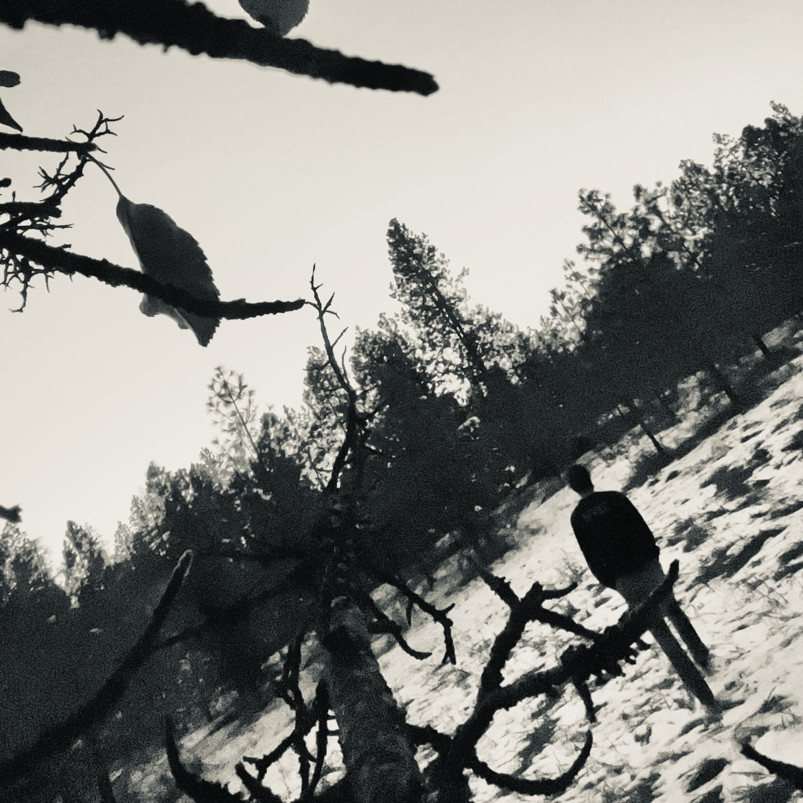
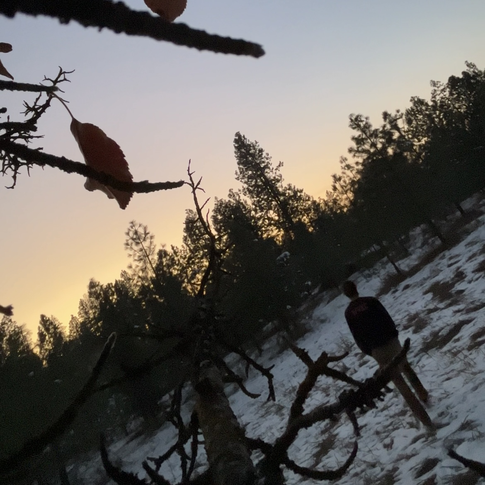
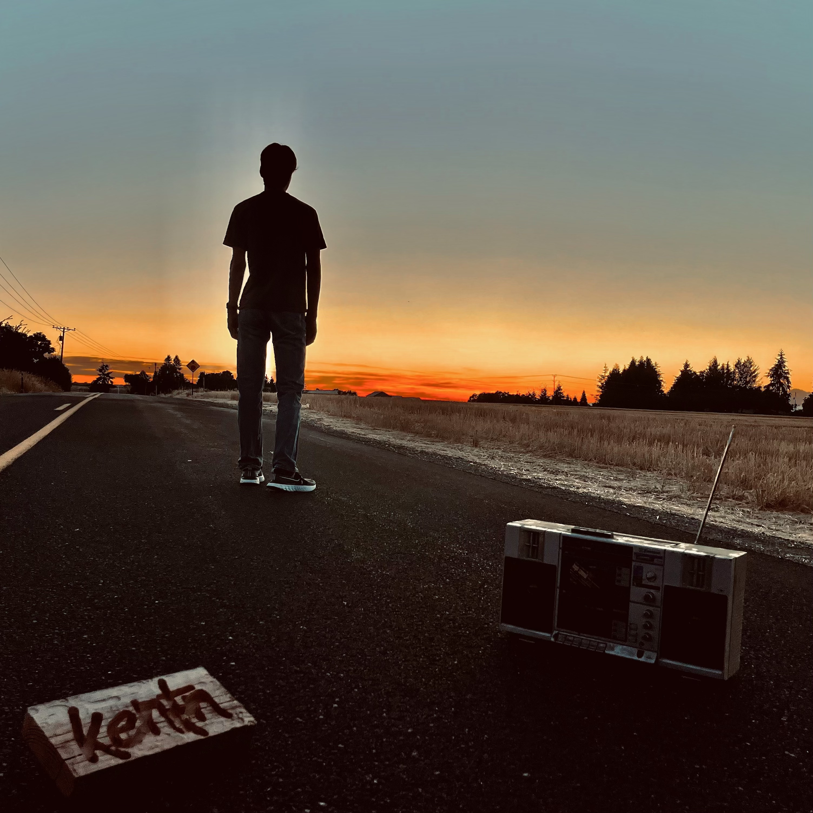
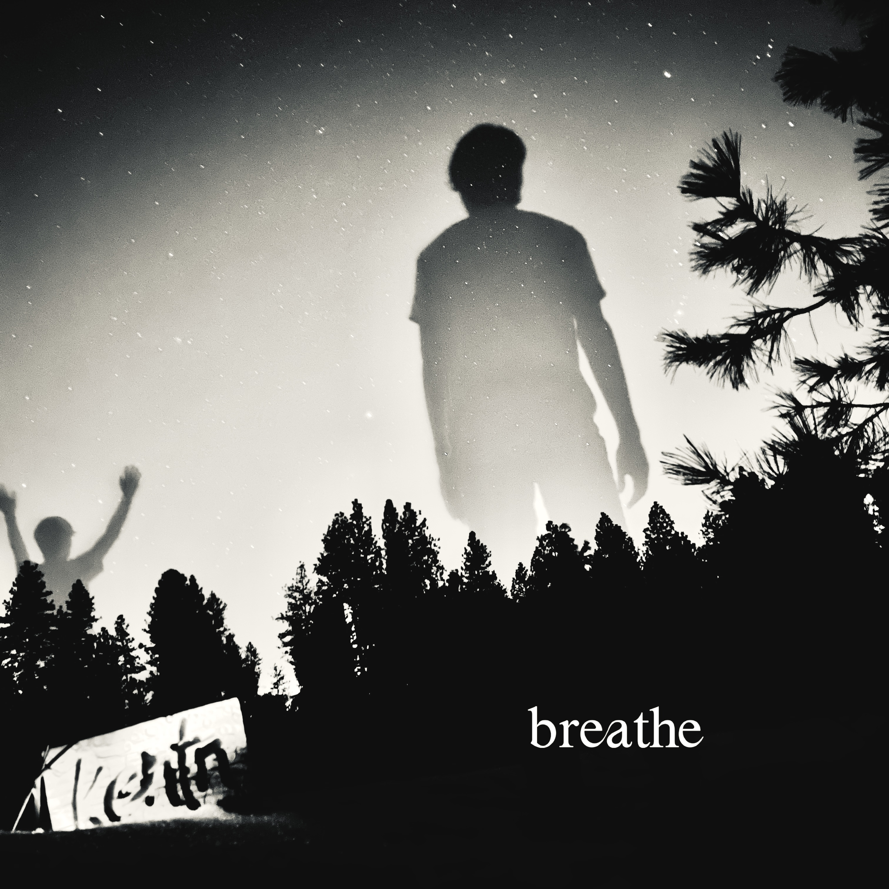

# kentn — Personal Portfolio & Creative Hub

[](https://kentonbell.github.io/)
[](index.html)
[](https://pages.github.com/)

A compact, responsive landing page that brings Kenton Bell's software, research, music, photography, and public profiles into one fast-loading destination.

> **Research highlight:** the repository includes the IEEE AIxVR 2026 paper [*Handwriting Recognition in VR for Enhanced Learning and Immersive Interaction Experience*](images/GraduateThesisHandwritingRecognition.pdf). The paper acknowledges Kenton Bell and Matthew Froese for the virtual environment, which originated in a Spring 2025 virtual-painting project and provides a foundation for continued senior-project work in immersive drawing and learning.



## What the site does

The live page is designed as a focused link hub rather than a multi-page portfolio. A visitor can move directly to Kenton's professional profile, social presence, artist pages, current releases, private-access material, and a small JSON announcement endpoint. The restrained layout keeps those destinations readable on both phones and desktops.

The implementation is intentionally dependency-free: one semantic HTML document, embedded CSS, local media, and GitHub Pages hosting. That makes the site easy to audit, inexpensive to host, and quick to maintain.

## VR Drawing Studio and senior-project direction

The virtual drawing environment is the site's clearest bridge between creative practice and computer science. In the published research pipeline, a learner writes on a virtual notepad, adjusts ink color and line width, undoes strokes, captures the writing, and sends the image to a handwriting-recognition model. Recognition confidence can then become feedback for language practice or other individualized learning experiences.

The accompanying IEEE paper reports a useful engineering result: a baseline OCR approach struggled with several handwritten characters, while TrOCR recognized 19 of a 20-word VR handwriting dataset. That contrast motivates the next phase of the work—stronger recognition, better stroke rendering, multiple input techniques, and more meaningful learner feedback.

This is also a strong senior-thesis/senior-project platform because it joins several disciplines in one testable system:

- Unity and XR interaction design
- virtual pens, palettes, erasing, and line-width controls
- image capture and computer-vision handoff
- OCR/HTR model evaluation
- accessible, immersive learning experiences

## Visual identity and photography

The site's artwork is part of the product rather than decoration. The color and monochrome meadow portraits create a consistent personal identity across software and music work.



Nature photography extends that identity and reinforces the site's “Developer | Producer | Naturalist | Disciple” introduction.


## Music and release artwork

The site links directly to Kenton's Spotify, Apple Music, YouTube, and SoundCloud pages. Original cover art gives those destinations a distinct visual voice.


The remaining release imagery moves between documentary photography and high-contrast compositing.





## Design decisions

- **Mobile first:** a 650-pixel content column and fluid cards keep the experience comfortable on narrow screens.
- **Clear hierarchy:** profile, social links, producer links, and footer are visually separated without adding navigation overhead.
- **Accessible contrast:** white cards on a deep violet background keep link labels prominent.
- **Low operational cost:** no framework, build tool, database, or server is required.
- **Small API surface:** `api/anouncements.json` demonstrates that the same static host can expose lightweight structured data.

## Run locally

No installation is required. Clone the repository and open `index.html`, or serve it locally so browser behavior matches GitHub Pages:

```bash
python3 -m http.server 8000
```

Then visit `http://localhost:8000`.

## Repository map

```text
.
├── index.html                         # Responsive landing page and styles
├── api/
│   ├── anouncements.json             # Public announcement data
│   └── example.json
└── images/                            # Portraits, photography, release art, and IEEE paper
```

## Built by

[Kenton Bell](https://www.linkedin.com/in/kentonjbell/) — computer science student, cross-platform developer, producer, and immersive-computing collaborator.
